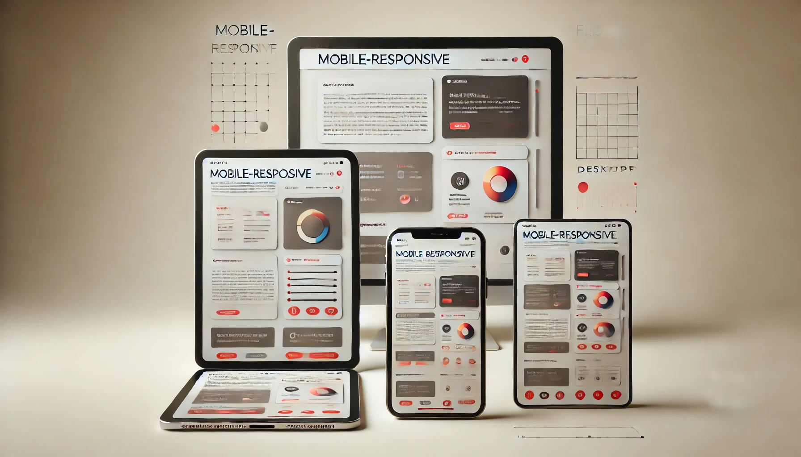

# React Native Responsive Dimention

[](https://github.com/babarbilal303/react-native-responsive-dimention/pulls)
[](http://facebook.github.io/react-native/)
[](https://github.com/babarbilal303/react-native-responsive-dimention/blob/master/LICENSE) 

A utility library for creating responsive designs in React Native applications. This package provides functions to scale components, text, and layouts according to different screen sizes and resolutions, ensuring a consistent look across all devices.

## Features

- **Responsive Width & Height**: Functions for scaling width and height based on the device’s screen size.
- **Responsive Font Size**: Easily adjust font sizes based on screen scaling.
- **Device Type Detection**: Determine whether the device is a tablet or a phone for better layout control.
- **Percentage-Based Sizing**: Functions to define components' width and height based on screen percentages.
- **Real-Time Dimensions Hook**: A hook to track and update layout dimensions dynamically based on screen size.

## Installation

To install the package, you can use npm or yarn:

```bash
npm i react-native-responsive-dimention
```

or if you prefer yarn:

```bash
yarn add react-native-responsive-dimention
```

## Usage

Import the utilities where you need them in your React Native project:

```javascript
import {
  rw,   // Responsive width
  rh,   // Responsive height
  rf,   // Responsive font size
  wp,   // Responsive width percentage
  hp,   // Responsive height percentage
  isTablet, // Check if the device is a tablet
  useResponsive // Hook for real-time screen dimension updates
} from 'react-native-responsive-dimention';
```

### Example Usage

#### Responsive Width & Height

To adjust the size of an element based on the screen size:

```javascript
import { View, Text } from 'react-native';
import { rw, rh } from 'react-native-responsive-dimention';

const MyComponent = () => {
  return (
    <View style={{ width: rw(100), height: rh(200) }}>
      <Text style={{ fontSize: rf(16) }}>Responsive Design</Text>
    </View>
  );
};
```

#### Responsive Font Size

Use `rf` to set a font size that adapts based on screen size:

```javascript
<Text style={{ fontSize: rf(20) }}>This is responsive text</Text>
```

#### Checking if the Device is a Tablet

You can use the `isTablet()` function to check if the device is a tablet and adjust your design accordingly:

```javascript
if (isTablet()) {
  // Apply tablet-specific styles
}
```

#### Responsive Width & Height with Percentage

You can also define components’ width and height using percentages of the screen:

```javascript
<View style={{ width: wp(50), height: hp(30) }}>
  <Text>50% width and 30% height of the screen</Text>
</View>
```

#### Real-Time Responsive Hook

If you need real-time dimension updates (for example, when the screen size changes), use the `useResponsive` hook:

```javascript
import { useResponsive } from 'react-native-responsive-utils';

const MyComponent = () => {
  const { rw, rh, wp, hp } = useResponsive();
  
  return (
    <View style={{ width: rw(80), height: rh(40) }}>
      <Text>Responsive content here</Text>
    </View>
  );
};
```

## API

### `rw(width: number): number`

Returns a responsive width based on the screen size.

- **Parameters**: `width` (number) – the width to be scaled based on the screen.
- **Returns**: A scaled width based on the device’s screen size.

### `rh(height: number): number`

Returns a responsive height based on the screen size.

- **Parameters**: `height` (number) – the height to be scaled based on the screen.
- **Returns**: A scaled height based on the device’s screen size.

### `rf(size: number, factor: number = 0.5): number`

Returns a responsive font size.

- **Parameters**:
  - `size` (number): The base font size.
  - `factor` (number, optional): The scaling factor, default is `0.5`.
- **Returns**: A scaled font size based on the screen size.

### `wp(percentage: number): number`

Returns a responsive width based on a percentage of the screen width.

- **Parameters**: `percentage` (number) – the percentage of the screen width.
- **Returns**: The calculated width based on the screen percentage.

### `hp(percentage: number): number`

Returns a responsive height based on a percentage of the screen height.

- **Parameters**: `percentage` (number) – the percentage of the screen height.
- **Returns**: The calculated height based on the screen percentage.

### `isTablet(): boolean`

Detects if the device is a tablet.

- **Returns**: A boolean indicating whether the device is a tablet (`true`) or not (`false`).

### `useResponsive()`

Returns a hook that provides real-time screen dimensions for responsive design.

- **Returns**: An object containing `rw`, `rh`, `wp`, and `hp` functions to calculate responsive sizes.

## Contributing

Contributions are welcome! Feel free to fork the repository, create a branch, and submit a pull request. If you find a bug or have an idea for a new feature, open an issue, and we’ll be happy to discuss it.

## License

MIT License – see the [LICENSE](LICENSE) file for details.

---

